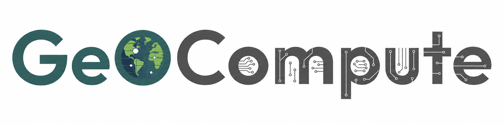

# About Us

At the GeoCompute Lab, we develop scalable geospatial computing and AI methods to transform big spatial data into actionable knowledge for environmental, societal, and infrastructure challenges.

## What We Do
The GeoCompute Lab advances geospatial computing to understand a changing world. We connect computing infrastructure, algorithm development, and urban applications to address scientific and societal challenges. Our research focuses on three complementary areas:

### 1) Geocomputing Infrastructure
We investigate the cyberinfrastructure and data infrastructure needed to support scalable geospatial research. Our work examines how computing resources, data formats, storage systems, and software environments support the management and analysis of large, diverse geospatial datasets. We develop open-source tools and reproducible workflows to make advanced geospatial computing more efficient and accessible.

### 2) Efficient Geospatial Algorithm/Model
We develop and optimize algorithms for computational-intensive geospatial problems. By integrating spatial algorithm design, AI, and advanced cyberinfrastructure, we improve how geospatial data are processed, analyzed, and modeled. Our research examines computational performance and scalability while accounting for spatial relationships, enabling analyses across larger datasets and finer spatial and temporal resolutions.

### 3) Geocomputation for Urban Informatics
We apply geospatial computing to understand how cities change and how urban environments affect people. Integrating geospatial computing, advanced modeling (e.g., AI, large-scale simulation) and heterogeneous geospatial urban big data (e.g., street view imagery, satellite observations, sensor networks, VGI data), we investigate different urban dynamics topics (e.g., urban changes, heat exposure, spatial accessibility). These applications motivate new computational methods and generate knowledge to inform urban planning, sustainability, and resilience.

## Who We Are
The GeoCompute Lab is based in the Department of Geography at Virginia Tech and directed by Dr. Fangzheng Lyu. Our research connects GIScience, geospatial data science, artificial intelligence, and high-performance computing.

## Sponsor
Our research and training activities are supported by the United States National Science Foundation (NSF), NSF ACCESS and Virginia Tech.

